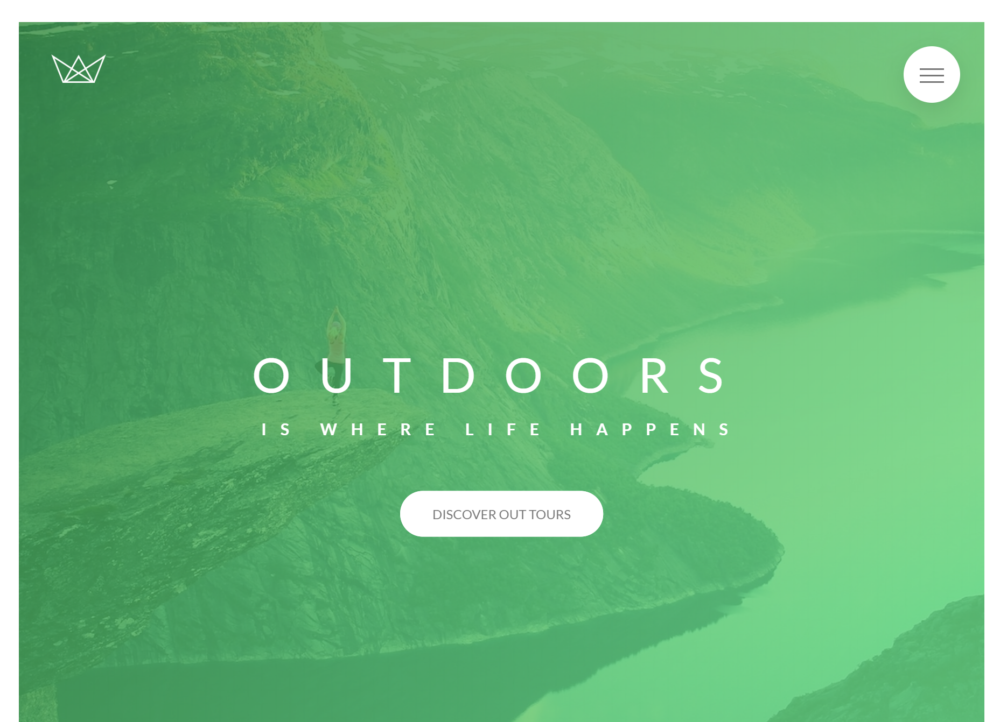
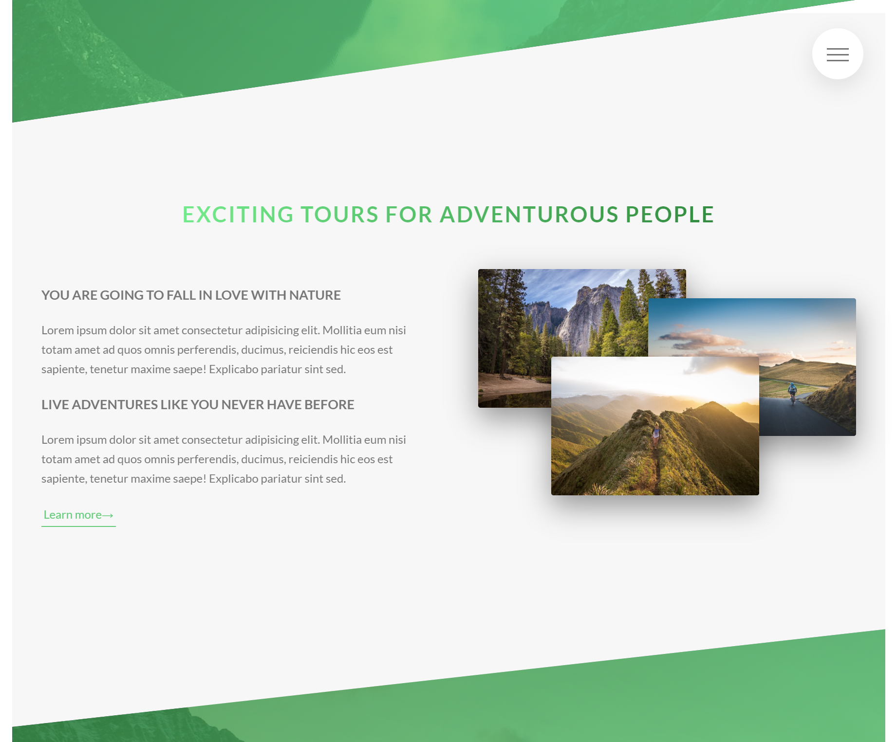
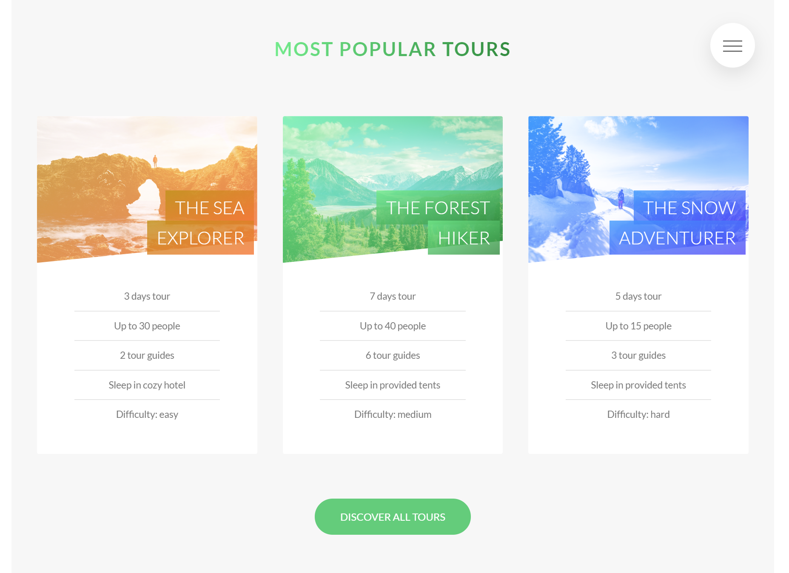

# NATOURS
A training project to build a website for a frictional travel touring company.

## Credited Statement
This is one of my homework projects in the web frontend design and programing bootcamp, the design of the website and traing material is from one of the best instructors in the business, in this homework assignment, I am the student and a programmer to perform all of the coding followed the teaching concepts tought in the course.

### Designer/Instructor/Programmer

Course Designer/Instructor/Developer: Jonas Schmedtmann

Student/Programmer: Chris Thanh Nguyen

### What I can do after this training?
After finish the training course, I am able to understand all the concepts and now able to design and code very high quality and most beatifull web/app front and fill confident to produce many challenging realworld  frontend projects.

## View the website
[Click to run](https://monksedo.github.io/natours/)

## Screenshot
### Home page

### About page

### Features page

### Tour booking page

